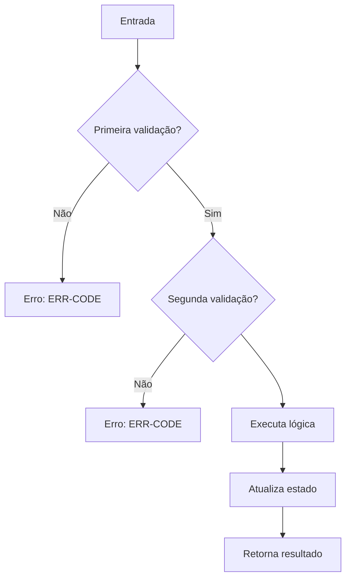
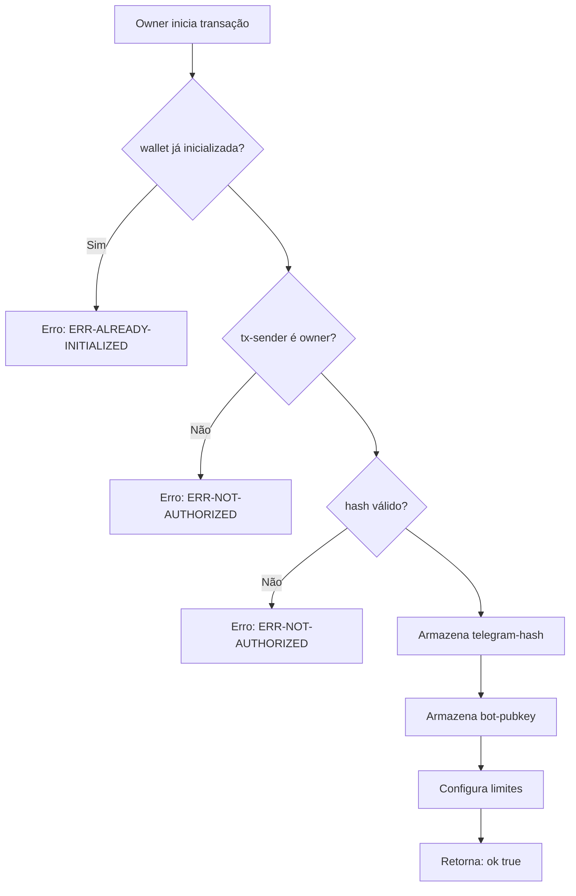
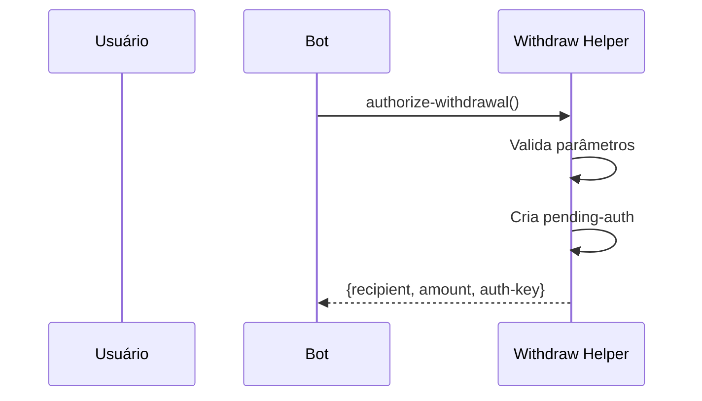

# clarity-flowcharts

**Description**: Cria diagramas de fluxo Mermaid para contratos Clarity. Gera fluxos visuais de funções públicas, validações, erros e interações entre contratos.

**When to use**: Quando você precisa documentar ou visualizar o fluxo de execução de contratos Clarity, entender validações, ou criar documentação visual para audit.

## Context

Você está criando diagramas de fluxo para contratos inteligentes Clarity no ecossistema Stacks. O projeto está em `/Volumes/MASS/lab-codingsh/bitcoin-yield/bitcoin-yield-copilot`.

## Skills

- **clarity-contracts**: Para entender a estrutura de contratos Clarity
- **clarity-compliance**: Para seguir padrões de documentação

## Instructions

### Passo 1: Analise o Contrato

Leia o arquivo `.clar` completo e identifique:

1. **Funções públicas** (`define-public`):
   - Nome da função
   - Parâmetros
   - Validações (asserts!)
   - Fluxo de execução
   - Retornos

2. **Constantes de erro**:
   - Códigos de erro (ex: `ERR-NOT-AUTHORIZED`)
   - Significado de cada um

3. **Maps e Data Vars**:
   - Estado do contrato
   - Recursos que precisam ser validados

### Passo 2: Crie o Diagrama

Siga estas regras para diagramas Mermaid:

#### Fluxo Básico de Função


#### Elementos a Usar

| Elemento | Sintaxe | Uso |
|----------|---------|-----|
| Nó retângulo | `[texto]` | Ação/normal |
| Decisão | `{texto?}` | Condição/validação |
| Erro | `[Erro: ERR-CODE]` | Return de erro |
| Conector | `A --> B` | Fluxo normal |
| Branch | `A -->|Sim| B` | Condição true |
| Branch | `A -->|Não| C` | Condição false |

#### Regras de Nomenclatura

- Use nomes descritivos em português
- Mantenha nomes de funções em inglês (ex: `execute-authorized-operation`)
- Agrupe validações relacionadas

### Passo 3: Estruture o Arquivo

Cada arquivo de diagrama deve seguir:

```markdown
# [Nome do Contrato] - [Título do Fluxo]

```mermaid
flowchart TD
    ... diagrama ...
```

## [Tabela de Funções]

| Função | Descrição | Autenticação |
|--------|-----------|---------------|
| nome | o que faz | como valida |
```

### Passo 4: Salve no Local Correto

- Pasta: `graph/`
- Nome: `{nome-do-contrato}.md`
- Use lowercase com hifens

## Examples

### Exemplo: Função Simples
**Input**: `initialize` do user-wallet.clar

```clarity
(define-public (initialize (tg-hash (buff 32)) (bot-pk (buff 33)) ...)
```

**Output**:


### Exemplo: Função Complexa com Sequência
**Input**: authorize-withdrawal do withdraw-helper.clar

**Output**:


## Output Requirements

1. **Extensão**: Use `.md` com código Mermaid
2. **Localização**: Sempre em `graph/`
3. **Formato**: Fluxchart para lógica, SequenceDiagram para interações
4. **Idioma**: Comments e descrições em português
5. **Completude**: Inclua TODOS os caminhos de erro

## Verification

Após criar o diagrama:
1. Teste no [Mermaid Live Editor](https://mermaid.live/)
2. Verifique se todos os `asserts!` estão representados
3. Confirme que todos os retornos estão no fluxo
4. Valide que não há caminhos órfãos
