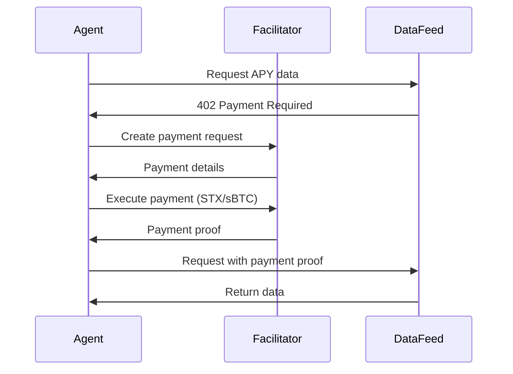

# x402 Payments Integration

This document describes the x402 payment integration for Bitcoin Yield Copilot.

## Overview

x402 is a payment protocol that enables micro-payments for API requests. Bitcoin Yield Copilot uses x402 to:
- Pay for data feeds (APY, prices)
- Enable paid data endpoints
- Manage agent service fees

## Architecture

```
┌─────────────┐     402      ┌──────────────────┐
│   Agent     │ ──────────► │  x402 Facilitator │
│             │  Payment    │                  │
│             │ ◄────────── │   (payments)     │
└─────────────┘  Response   └──────────────────┘
       │
       │ API Calls
       ▼
┌─────────────┐
│ Data Feeds  │
│ - APY Data  │
│ - Price Data│
└─────────────┘
```

## Payment Flow

### 1. Data Request (402 Response)



### 2. Payment Verification

```typescript
interface X402PaymentRequest {
  scheme: string;      // 'stacks-exact'
  price: string;       // Amount in STX/sBTC
  network: string;    // 'stacks:mainnet'
  payTo: string;      // Recipient address
  description: string;
  token?: 'STX' | 'sBTC' | 'USDCx';
  expiration?: number;
}
```

## Usage

### Creating a Payment Request

```typescript
import { x402Client } from './x402/client.js';

const paymentRequest = await x402Client.createPaymentRequest(
  '0.001',        // 0.001 STX
  'APY data for Zest protocol',
  'STX'
);
```

### Consuming Paid Endpoints

```typescript
// Automatic payment and retry
const apyData = await x402Client.getPaidAPYData('zest');
```

### Creating a Paid Endpoint

```typescript
const paidEndpoint = x402Client.createPaymentEndpoint(
  '0.001',
  'Premium yield data',
  async (req) => {
    return { apy: 8.5, tvl: 5000000 };
  }
);
```

## Supported Tokens

| Token | Symbol | Decimals |
|-------|--------|----------|
| Stacks | STX | 6 |
| sBTC | sBTC | 8 |
| USDC | USDCx | 6 |

## Cost Structure

| Data Type | Estimated Cost |
|-----------|---------------|
| APY Data | ~0.001 STX |
| Price Data | ~0.001 STX |
| Protocol Info | ~0.0005 STX |

## Configuration

```env
# x402 Payments
X402_FACILITATOR_URL=https://x402.aibtc.com
```

## Error Handling

### 402 Payment Required

When an endpoint requires payment:

```typescript
if (response.status === 402) {
  const paymentRequest = await response.json();
  // Auto-pay enabled via retryOn402: true
}
```

### Payment Verification Failed

```typescript
{
  status: 402,
  headers: {
    'X-Payment-Verification': 'failed'
  }
}
```

## Security Considerations

1. **Payment Proof**: Always include payment proof in subsequent requests
2. **Expiration**: Payment requests expire after 5 minutes
3. **Verification**: Verify payments on-chain before delivering data
4. **Fee Estimation**: Always estimate fees before making payments

## Methods Reference

| Method | Description |
|--------|-------------|
| `createPaymentRequest()` | Create a new payment request |
| `verifyPayment()` | Verify a payment was made |
| `makePayment()` | Execute a payment |
| `consumePaidEndpoint()` | Call endpoint with auto-payment |
| `getPaidAPYData()` | Get APY data for a protocol |
| `getPaidPriceData()` | Get price data for tokens |

## Integration with Agent

The agent integrates x402 payments into decision logic:

1. Before fetching external data, check if endpoint requires payment
2. If 402 response, automatically process payment
3. Include payment cost in yield calculations
4. Pass through costs to user via service fees
