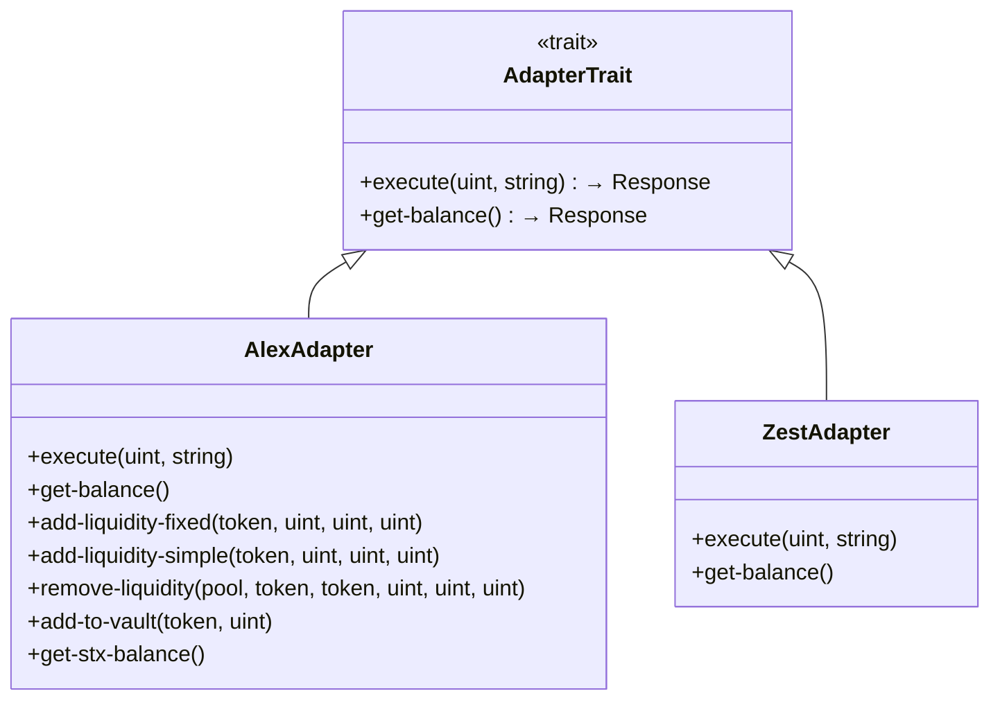
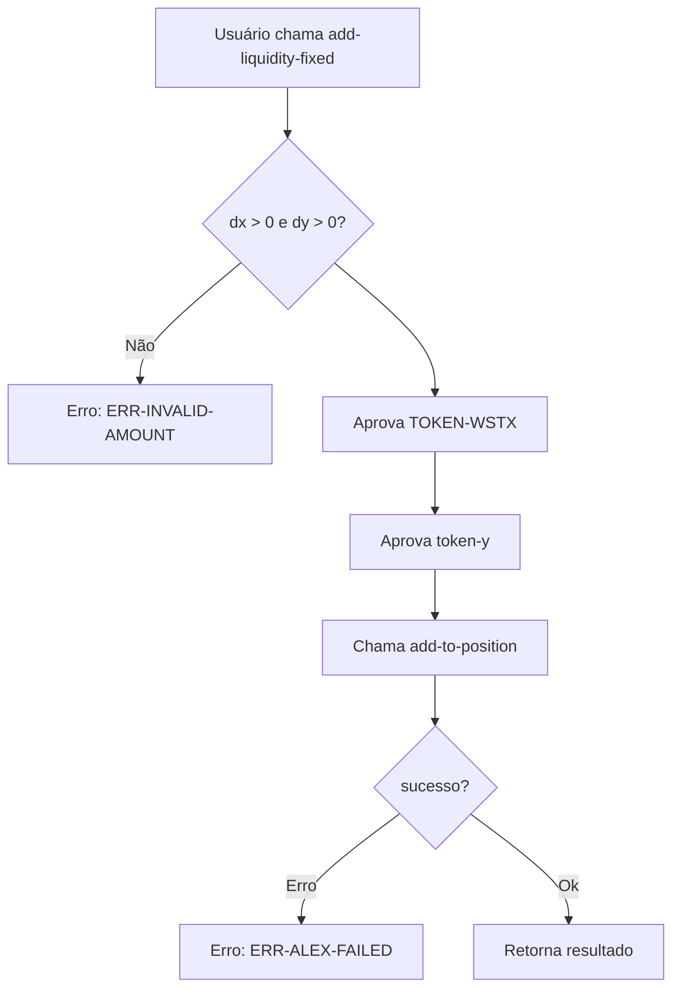
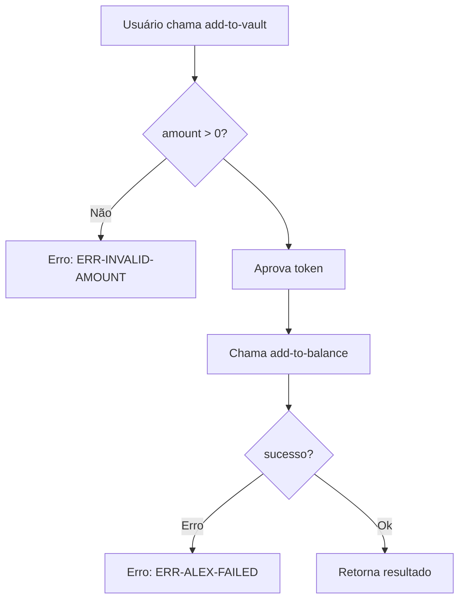
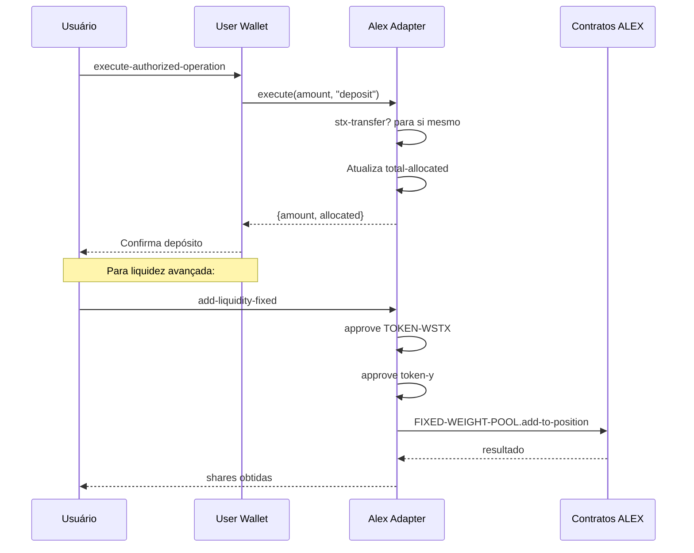

# Adapter Trait - Interface Comum



# Alex Adapter - Fluxo de Execute (Deposit/Withdraw)

```mermaid
flowchart TD
    A[User Wallet chama execute] --> B{amount > 0?}
    B -->|Não| C[Erro: ERR-INVALID-AMOUNT]
    B --> D{ação = deposit?}
    D -->|Sim| E[Recebe STX para adapter]
    E --> F[Atualiza total-allocated]
    F --> G[Retorna: {amount, allocated}]
    D -->|Não| H{ação = withdraw?}
    H -->|Não| I[Erro: ERR-INVALID-ACTION]
    H --> J{balance >= amount?}
    J -->|Não| K[Erro: ERR-INSUFFICIENT-BALANCE]
    J --> L[Transfere STX para wallet]
    L --> M[Atualiza total-allocated]
    M --> G
```

# Alex Adapter - Adicionar Liquidez (Fixed)



# Alex Adapter - Adicionar ao Vault



# Alex Adapter - Fluxo de Integração Completo



# Alex Adapter - Funções Públicas

| Função | Descrição | Requerimentos |
|--------|-----------|---------------|
| `execute` | Deposit/Withdraw básico | amount > 0 |
| `get-balance` | Retorna total alocado | - |
| `add-liquidity-fixed` | Adiciona liquidez com pesos fixos | dx, dy > 0, aprovações |
| `add-liquidity-simple` | Adiciona liquidez simples | dx, dy > 0, aprovações |
| `remove-liquidity` | Remove liquidez | 0 < percent <= 100 |
| `add-to-vault` | Adiciona ao vault | amount > 0, aprovação |
| `get-stx-balance` | Retorna balance STX | - |
