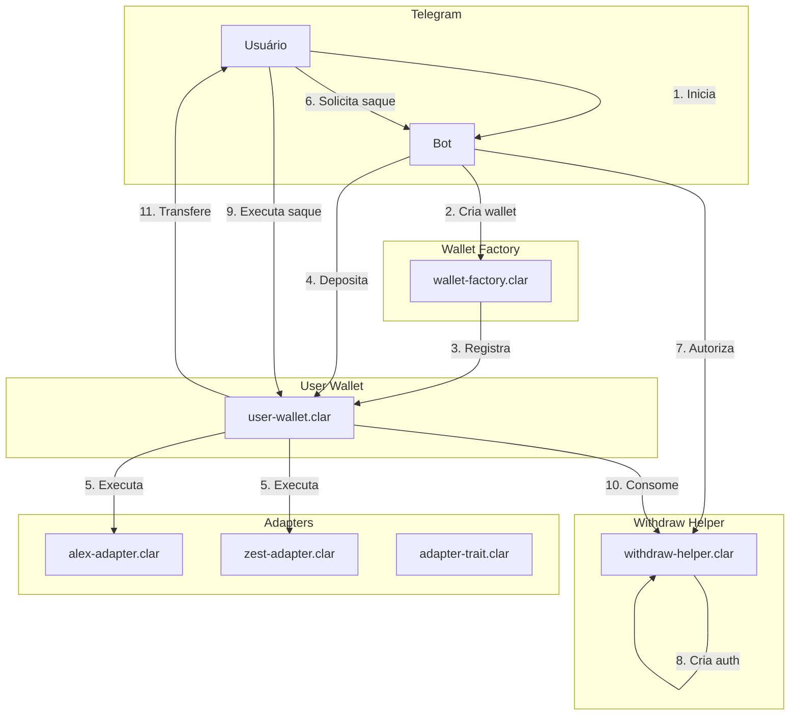
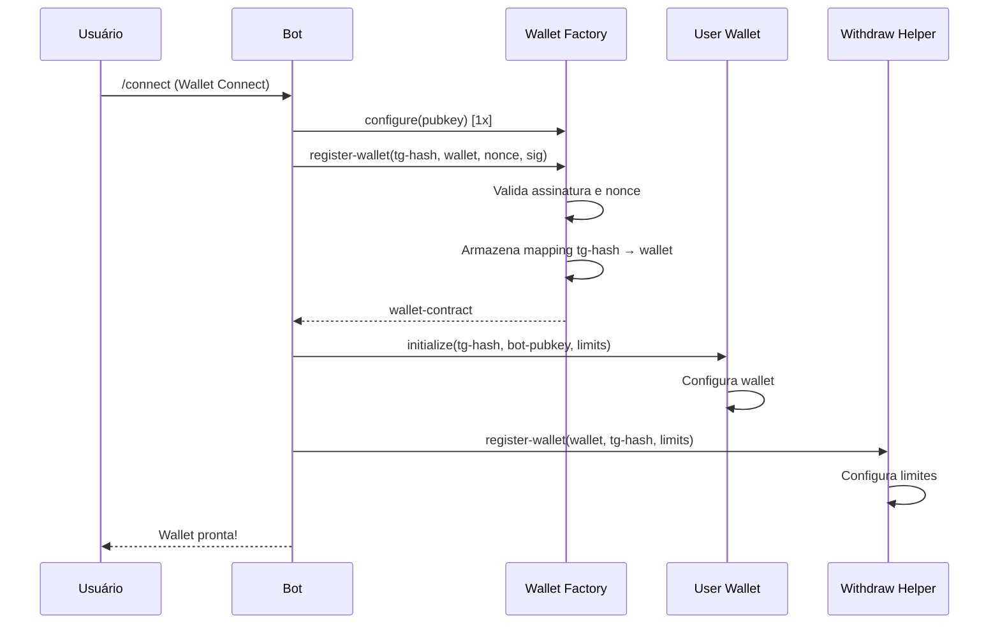
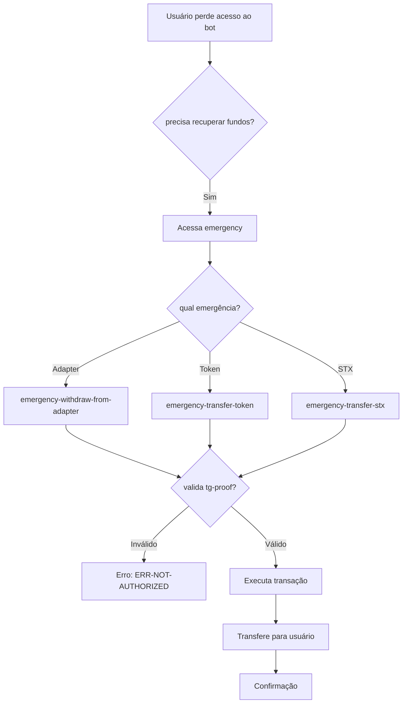

# Arquitetura Geral - Interação entre Contratos



# Fluxo Completo: Criação de Wallet



# Fluxo Completo: Depósito em Protocolo

```mermaid
sequenceDiagram
    participant U as Usuário
    participant B as Bot
    participant UW as User Wallet
    participant AA as Alex Adapter

    U->>B: "Depositar 100 sBTC"
    B->>B: Encontra protocolo (ALEX)
    B->>B: Verifica APY, riscos
    B->>U: "Encontrado: ALEX 8.5% APY. Confirmar?"
    U->>B: "Sim"
    B->>B: Prepara transação
    B->>UW: execute-authorized-operation(
        nonce, protocol, "deposit", amount, expiry, sig, adapter
    )
    UW->>UW: Valida limites, nonce, assinatura
    UW->>UW: Atualiza allocation
    UW->>AA: execute(amount, "deposit")
    AA->>AA: Recebe STX, atualiza balance
    AA-->>UW: {amount, allocated}
    UW-->>B: {amount, allocated}
    B-->>U: ✅ Depósito confirmado! 100 sBTC em ALEX
```

# Fluxo Completo: Saque

```mermaid
sequenceDiagram
    participant U as Usuário
    participant B as Bot
    participant UW as User Wallet
    participant WH as Withdraw Helper

    U->>B: "Sacar 50 sBTC"
    B->>B: Confirma saldo
    B->>B: Prepara autorização
    B->>WH: authorize-withdrawal(
        wallet, nonce, amount, recipient, expiry, tg-proof, sig
    )
    WH->>WH: Valida tudo
    WH->>WH: Cria pending-auth
    WH-->>B: {recipient, amount, auth-key}
    B->>U: "Autorização criada. Confirme no app:"
    B->>U: [Link de confirmação]
    U->>UW: withdraw-stx(amount, recipient, expiry, auth-key)
    UW->>WH: consume-authorization(...)
    WH->>WH: Valida auth-key, debita limites
    WH-->>UW: {net-amount, fee-amount, treasury}
    UW->>U: Transfere net-amount
    UW->>Treasury: Transfere fee (se houver)
    UW-->>B: Confirmação
    B-->>U: ✅ Saque confirmado! 49.5 sBTC recebidos
```

# Fluxo de Emergency



# Tabela de Erros Global

| Código | Erro | Origem |
|--------|------|--------|
| u401 | ERR-NOT-AUTHORIZED | Todas funções |
| u402 | ERR-INVALID-SIGNATURE | Validação |
| u403 | ERR-LIMIT-EXCEEDED | Limites |
| u404 | ERR-EXPIRED | Nonce/Block |
| u405 | ERR-PAUSED | Pausa |
| u406 | ERR-UNKNOWN-PROTOCOL | Protocolo |
| u407 | ERR-DAILY-LIMIT | Limites |
| u408 | ERR-NOT-INITIALIZED | Inicialização |
| u409 | ERR-ALREADY-INITIALIZED | Inicialização |
| u410 | ERR-INVALID-LIMITS | Limites |
| u411 | ERR-ZERO-AMOUNT | Amount |
| u412 | ERR-PROTOCOL-EXISTS | Protocolo |
| u413 | ERR-ALLOCATION-EXCEEDED | Alocação |
| u415 | ERR-INSUFFICIENT-BALANCE | Saldo |
| u416 | ERR-AMOUNT-TOO-SMALL | Amount |
| u417 | ERR-RATE-LIMIT | Rate limit |
| u418 | ERR-WALLET-REVOKED | Wallet |
| u419 | ERR-DAILY-LIMIT | Limites |
| u420 | ERR-LIMIT-EXCEEDED | Limites |
| u421 | ERR-INVALID-PUBKEY | Pubkey |
| u422 | ERR-ALREADY-INITIALIZED | Inicialização |
| u423 | ERR-WALLET-NOT-FOUND | Wallet |
| u424 | ERR-INVALID-RECIPIENT | Recipient |
| u425 | ERR-INVALID-LIMITS | Limites |
| u426 | ERR-NOT-REVOKED | Revogação |
| u427 | ERR-AUTH-EXISTS | Auth |
| u428 | ERR-INVALID-FEE | Taxa |
| u500 | ERR-ALEX-FAILED | ALEX |
