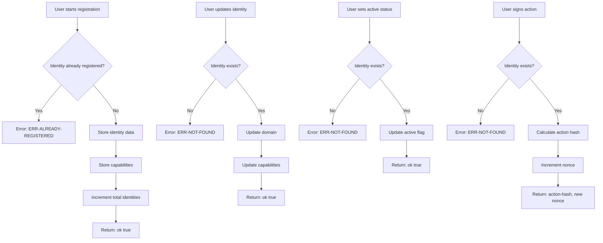

# ERC-8004 Identity - Contract Flow

## Function Summary

| Function | Description | Authentication |
|---------|-------------|----------------|
| `register-identity` | Register new on-chain identity | None (first come first served) |
| `update-identity` | Update domain and capabilities | Must be identity owner |
| `set-active` | Toggle identity active status | Must be identity owner |
| `sign-action` | Sign an action with identity | Must be identity owner |
| `get-identity` | Get identity details | Public |
| `get-capabilities` | Get identity capabilities | Public |
| `is-active` | Check if identity is active | Public |
| `is-registered` | Check if address is registered | Public |
| `get-total-identities` | Get total registered identities | Public |

## Data Structures

### identities (map)
- `domain`: string-ascii 64 - Agent domain
- `nonce`: uint - Action counter for signatures
- `active`: bool - Whether identity is active
- `registered-at`: uint - Block height of registration

### identity-capabilities (map)
- List of up to 10 capability strings

## Error Codes

| Code | Meaning |
|------|---------|
| `ERR-NOT-FOUND` | Identity not registered |
| `ERR-ALREADY-REGISTERED` | Address already has identity |
