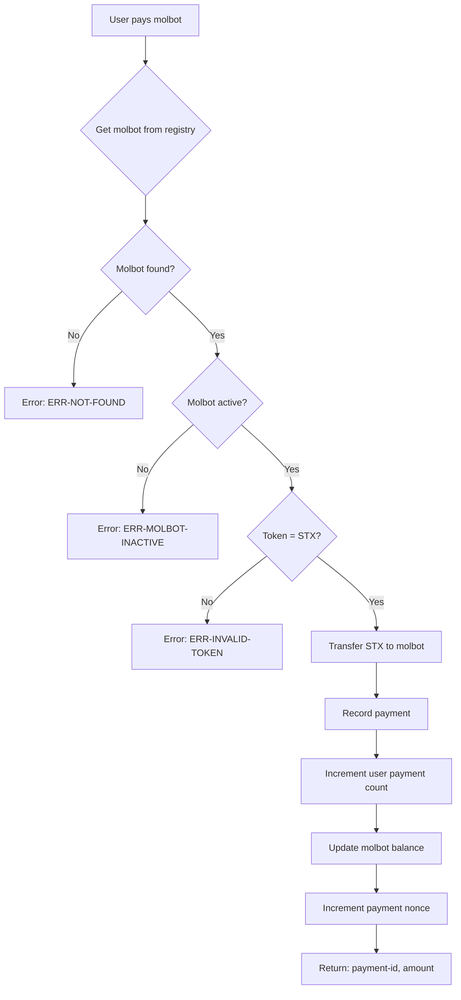
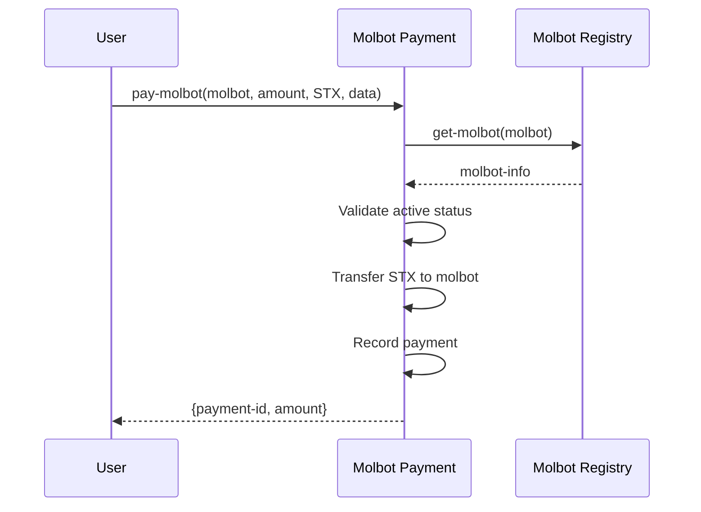

# Molbot Payment - Contract Flow

## Function Summary

| Function | Description | Authentication |
|---------|-------------|----------------|
| `pay-molbot` | Pay a molbot for service | Requires STX transfer |
| `get-payment` | Get payment details by sender and nonce | Public |
| `get-user-payment-count` | Get total payments by user | Public |
| `get-molbot-balance` | Get total balance earned by molbot | Public |
| `get-total-payments` | Get total payments processed | Public |

## Data Structures

### payments (map)
Key: `{ sender: principal, nonce: uint }`
- `recipient`: principal - Molbot address
- `amount`: uint - Payment amount
- `token`: string-ascii 8 - Payment token (STX, sBTC, USDCx)
- `service-data`: buff 256 - Service metadata
- `completed`: bool - Whether payment completed

### user-payment-counts (map)
- Tracks number of payments per user

### molbot-balances (map)
- Tracks total earnings per molbot

## Error Codes

| Code | Meaning |
|------|---------|
| `ERR-NOT-FOUND` | Molbot not in registry |
| `ERR-MOLBOT-INACTIVE` | Molbot is not active |
| `ERR-INVALID-TOKEN` | Token not supported |

## Integration

