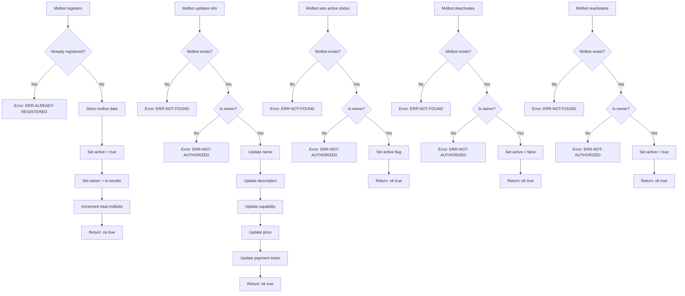

# Molbot Registry - Contract Flow

## Function Summary

| Function | Description | Authentication |
|---------|-------------|----------------|
| `register-molbot` | Register new molbot | None (first come first served) |
| `update-molbot` | Update molbot information | Must be owner |
| `set-active` | Set active status | Must be owner |
| `deactivate` | Deactivate molbot | Must be owner |
| `reactivate` | Reactivate molbot | Must be owner |
| `get-molbot` | Get molbot details | Public |
| `get-molbot-price` | Get price for molbot service | Public |
| `is-registered` | Check if address is registered | Public |
| `is-active` | Check if molbot is active | Public |
| `get-total-molbots` | Get total registered molbots | Public |

## Data Structures

### molbots (map)
- `name`: string-ascii 64 - Molbot name
- `description`: string-ascii 256 - Molbot description
- `capability`: string-ascii 32 - Service capability (yield-optimizer, content-generator, etc.)
- `price-per-call`: uint - Price per service call
- `payment-token`: string-ascii 8 - Token accepted (STX, sBTC, USDCx)
- `active`: bool - Whether molbot is active
- `owner`: principal - Molbot owner address
- `registered-at`: uint - Block height of registration

## Error Codes

| Code | Meaning |
|------|---------|
| `ERR-NOT-FOUND` | Molbot not registered |
| `ERR-NOT-AUTHORIZED` | Not the molbot owner |
| `ERR-ALREADY-REGISTERED` | Address already has molbot |
