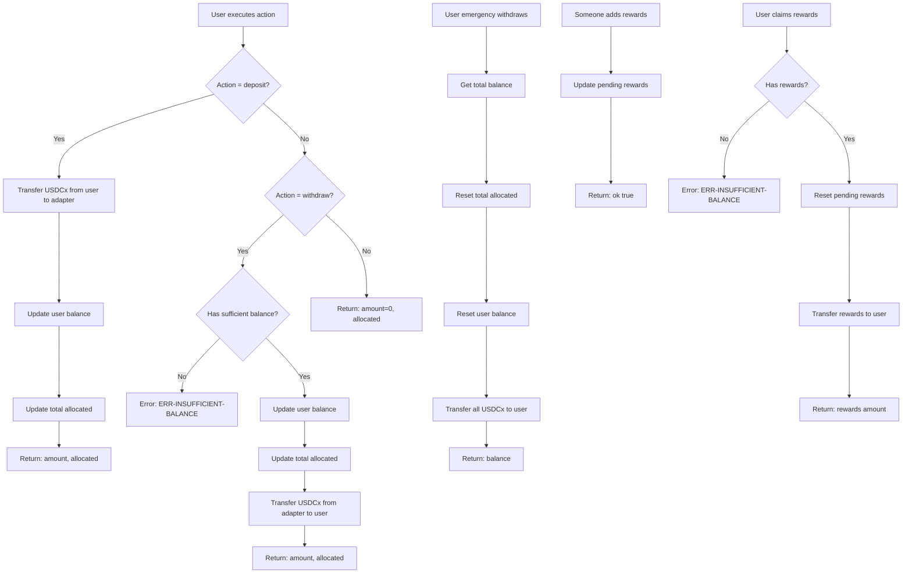
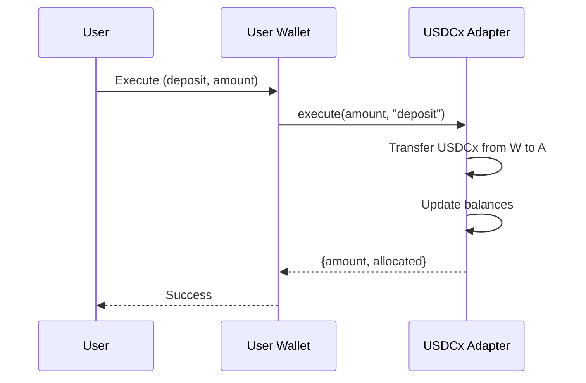

# USDCx Adapter - Contract Flow

## Function Summary

| Function | Description | Authentication |
|---------|-------------|----------------|
| `execute` | Deposit or withdraw USDCx | Via user-wallet |
| `get-balance` | Get total allocated | Public |
| `get-user-balance` | Get user balance | Public |
| `get-pending-rewards` | Get pending rewards | Public |
| `emergency-withdraw` | Emergency withdraw all funds | Owner only |
| `add-rewards` | Add rewards to pool | External |
| `claim-rewards` | Claim earned rewards | User |

## Data Structures

### user-balances (map)
- Tracks USDCx balance per user

## State Variables

- `total-allocated`: Total USDCx in adapter
- `pending-rewards`: Pending rewards to be claimed

## Error Codes

| Code | Meaning |
|------|---------|
| `ERR-INSUFFICIENT-BALANCE` | User has insufficient balance |

## Integration with User Wallet

