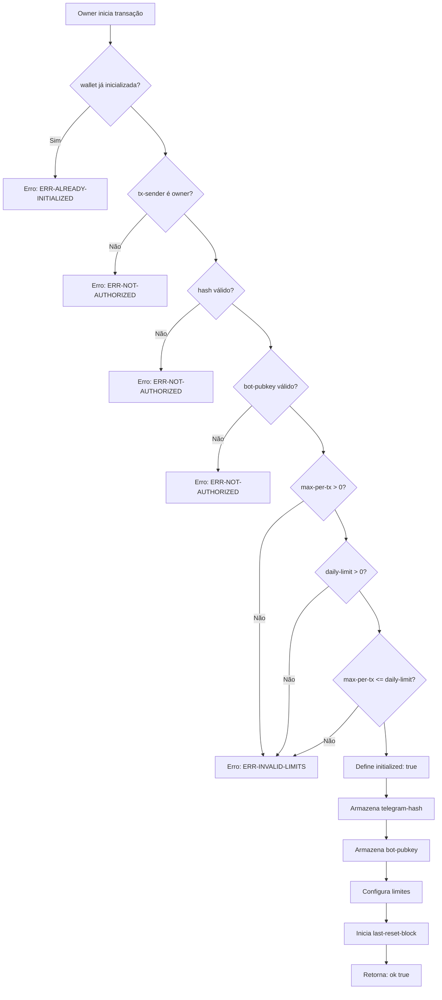
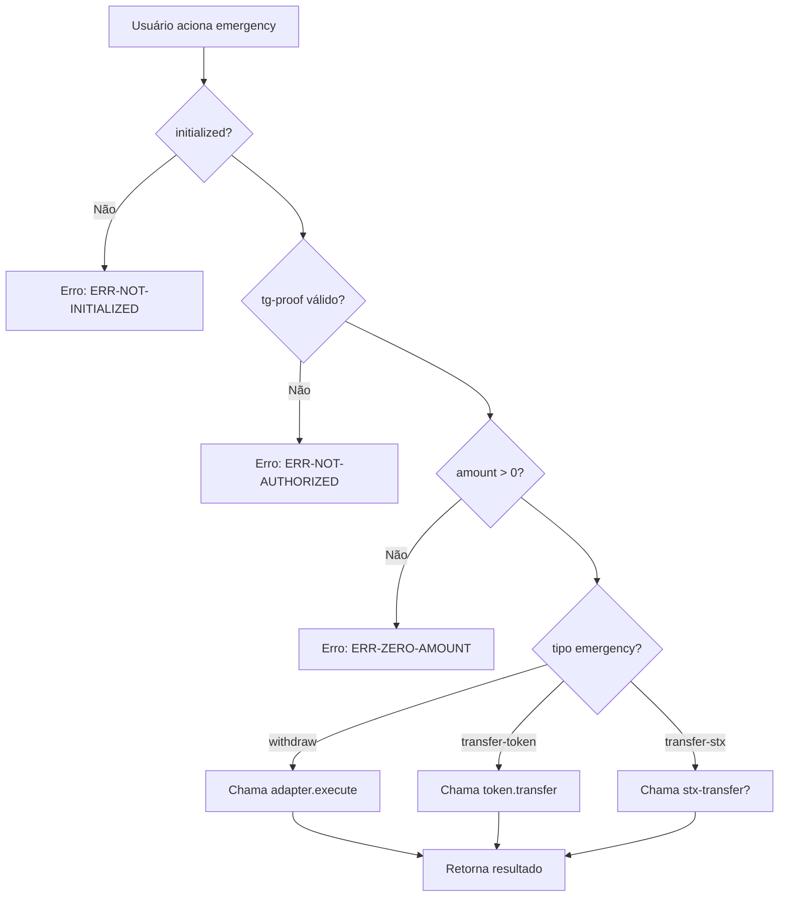

# User Wallet - Fluxo de Inicialização



# User Wallet - Execute Authorized Operation

```mermaid
flowchart TD
    A[Bot envia operação] --> B{initialized?}
    B -->|Não| C[Erro: ERR-NOT-INITIALIZED]
    B --> D{pausado?}
    D -->|Sim| E[Erro: ERR-PAUSED]
    D --> F{amount > 0?}
    F -->|Não| G[Erro: ERR-ZERO-AMOUNT]
    F --> H{nonce válido?}
    H -->|Não| I[Erro: ERR-EXPIRED]
    H --> J{block expirado?}
    J -->|Sim| K[Erro: ERR-EXPIRED]
    J --> L{assinatura válida?}
    L -->|Não| M[Erro: ERR-INVALID-SIGNATURE]
    L --> N{protocol permitido?}
    N -->|Não| O[Erro: ERR-UNKNOWN-PROTOCOL]
    N --> P{protocol enabled?}
    P -->|Não| O
    P --> Q{amount <= max-per-tx?}
    Q -->|Não| R[Erro: ERR-LIMIT-EXCEEDED]
    Q --> S{spent + amount <= daily-limit?}
    S -->|Não| T[Erro: ERR-DAILY-LIMIT]
    S --> U{allocation <= max-allocation?}
    U -->|Não| V[Erro: ERR-ALLOCATION-EXCEEDED]
    U --> W[Atualiza nonce]
    W --> X[Atualiza spent-today]
    X --> Y[Atualiza allocation]
    Y --> Z[Executa no adapter]
    Z --> AA[Retorna: {amount, allocated}]
```

# User Wallet - Fluxo de Saque (STX/Token)

```mermaid
flowchart TD
    A[Usuário solicita saque] --> B{initialized?}
    B -->|Não| C[Erro: ERR-NOT-INITIALIZED]
    B --> D{pausado?}
    D -->|Sim| E[Erro: ERR-PAUSED]
    D --> F{amount > 0?}
    F -->|Não| G[Erro: ERR-ZERO-AMOUNT]
    F --> H{block expirado?}
    H -->|Sim| I[Erro: ERR-EXPIRED]
    H --> J{auth-key existe?}
    J -->|Não| K[Erro: ERR-NOT-AUTHORIZED]
    J --> L{balance suficiente?}
    L -->|Não| M[Erro: ERR-INSUFFICIENT-BALANCE]
    L --> N[Consome autorização]
    N --> O[Calcula taxas]
    O --> P[Transfere net-amount]
    P --> Q{taxa > 0?}
    Q -->|Sim| R[Transfere taxa para treasury]
    Q -->|Não| S[Retorna: {net-amount, fee-amount}]
    R --> S
```

# User Wallet - Fluxo de Emergency



# User Wallet - Funções Públicas

| Função | Descrição | Autenticação |
|--------|-----------|---------------|
| `initialize` | Inicializa wallet | Apenas owner |
| `execute-authorized-operation` | Executa deposit/withdraw no protocolo | Bot assinado, nonce, limites |
| `withdraw-stx` | Saque de STX | auth-key do withdraw-helper |
| `withdraw-token` | Saque de tokens | auth-key do withdraw-helper |
| `emergency-pause` | Pausa wallet | Bot assinado, nonce |
| `unpause` | Despausa wallet | Bot assinado, nonce |
| `update-limits` | Atualiza limites | Bot assinado, nonce, tg-proof |
| `add-protocol` | Adiciona protocolo | Bot assinado, nonce, tg-proof |
| `update-protocol` | Atualiza protocolo | Bot assinado, nonce, tg-proof |
| `emergency-withdraw-from-adapter` | Saque de emergência do adapter | tg-proof |
| `emergency-transfer` | Transferência de emergência de tokens | tg-proof |
| `emergency-transfer-stx` | Transferência de emergência de STX | tg-proof |
