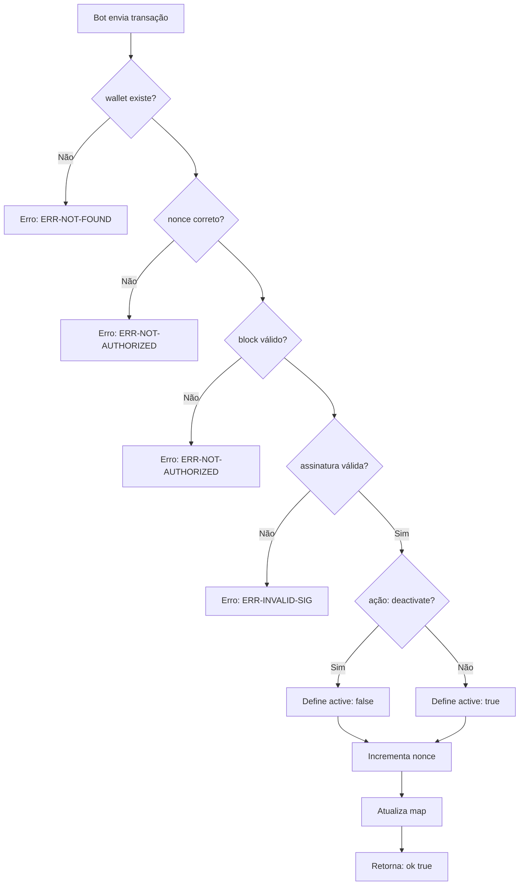

# Wallet Factory - Fluxo de Registro

```mermaid
flowchart TD
    A[Usuário Telegram] --> B[Bot cria transação]
    B --> C{wallet já existe?}
    C -->|Sim| D[Erro: ERR-ALREADY-EXISTS]
    C -->|Não| E[Factory verifica assinatura]
    E --> F{assinatura válida?}
    F -->|Não| G[Erro: ERR-INVALID-SIG]
    F -->|Sim| H[Verifica nonce]
    H --> I{nonce correto?}
    I -->|Não| J ERR-NOT-A[Erro:UTHORIZED]
    I -->|Sim| K[Registra wallet no map]
    K --> L[Atualiza total-wallets]
    L --> M[Incrementa factory-nonce]
    M --> N[Retorna: wallet-contract]
    N --> O[Bot confirma registro]
```

# Wallet Factory - Fluxo de Ativação/Desativação



# Wallet Factory - Funções Públicas

| Função | Descrição | Requerimentos |
|--------|-----------|---------------|
| `configure` | Configura a chave pública do bot | Apenas owner |
| `register-wallet` | Registra nova wallet para usuário | Bot assinado, nonce válido |
| `deactivate-wallet` | Desativa wallet | Bot assinado, nonce válido |
| `reactivate-wallet` | Reativa wallet | Bot assinado, nonce válido |
