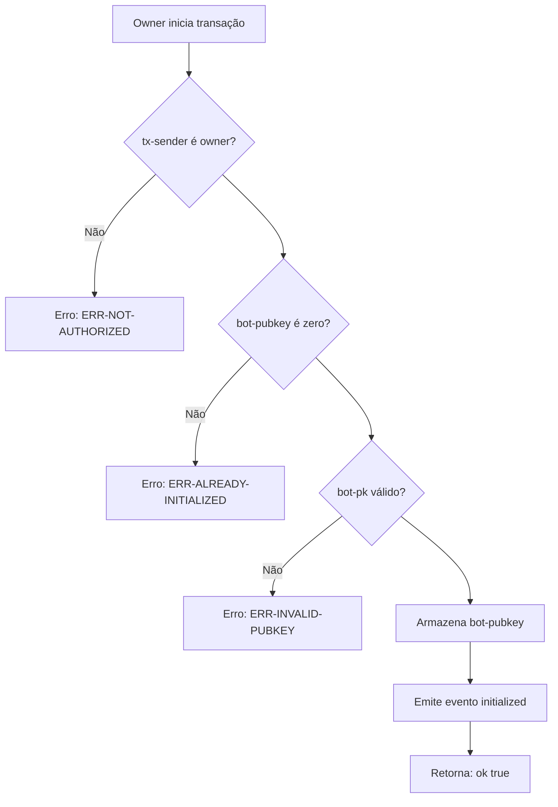
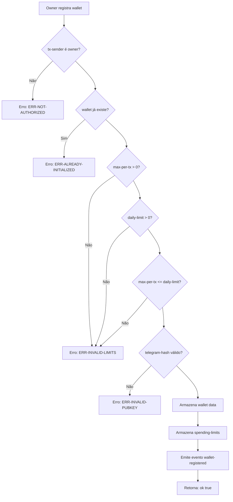
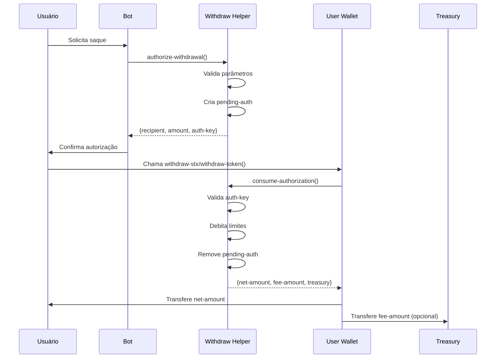

# Withdraw Helper - Fluxo de Inicialização e Configuração



# Withdraw Helper - Registro de Wallet



# Withdraw Helper - Autorização de Saque

```mermaid
flowchart TD
    A[Bot autoriza saque] --> B{pausado?}
    B -->|Sim| C[Erro: ERR-PAUSED]
    B --> D{wallet revogada?}
    D -->|Sim| E[Erro: ERR-WALLET-REVOKED]
    D --> F{amount > 0?}
    F -->|Não| G[Erro: ERR-ZERO-AMOUNT]
    F --> H{amount >= MIN?}
    H -->|Não| I[Erro: ERR-AMOUNT-TOO-SMALL]
    H --> J{recipient válido?}
    J -->|Não| K[Erro: ERR-INVALID-RECIPIENT]
    J --> L{nonce correto?}
    L -->|Não| M[Erro: ERR-EXPIRED]
    L --> N{tg-proof válido?}
    N -->|Não| O[Erro: ERR-NOT-AUTHORIZED]
    N --> P{block expirado?}
    P -->|Sim| Q[Erro: ERR-EXPIRED]
    P --> R{assinatura válida?}
    R -->|Não| S[Erro: ERR-INVALID-SIGNATURE]
    R --> T{auth-key já existe?}
    T -->|Sim| U[Erro: ERR-AUTH-EXISTS]
    T --> V[Verifica daily limit]
    V --> W{within limits?}
    W -->|Não| X[Erro: ERR-DAILY-LIMIT]
    W --> Y[Verifica rate limit]
    Y -->|Erro| Z[Erro: ERR-RATE-LIMIT]
    Y -->|Ok| AA[Cria pending-auth]
    AA --> AB[Emite evento withdrawal-authorized]
    AB --> AC[Retorna: {recipient, amount, auth-key}]
```

# Withdraw Helper - Consumo de Autorização

```mermaid
flowchart TD
    A[User wallet consome auth] --> B{auth existe?}
    B -->|Não| C[Erro: ERR-NOT-AUTHORIZED]
    B --> D{tx-sender = wallet?}
    D -->|Não| E[Erro: ERR-NOT-AUTHORIZED]
    D --> F{wallet = auth.wallet?}
    F -->|Não| E
    F --> G{recipient = auth.recipient?}
    G -->|Não| E
    G --> H{amount = auth.amount?}
    H -->|Não| E
    I{block <= expiry?}
    I -->|Não| J[Erro: ERR-EXPIRED]
    I --> K[Avança nonce]
    K --> L[Debita spending limit]
    L --> M[Remove pending-auth]
    M --> N[Calcula taxa]
    N --> O[Emite evento authorization-consumed]
    O --> P[Retorna: {net-amount, fee-amount, treasury}]
```

# Withdraw Helper - Fluxo Completo de Saque



# Withdraw Helper - Funções Públicas

| Função | Descrição | Autenticação |
|--------|-----------|---------------|
| `initialize` | Inicializa o contrato | Apenas owner |
| `set-fee` | Configura taxa de saque | Owner assinado, nonce |
| `register-wallet` | Registra nova wallet | Apenas owner |
| `update-wallet-limits` | Atualiza limites | Apenas owner |
| `revoke-wallet` | Revoga wallet | Apenas owner |
| `unrevoke-wallet` | Remove revogação | Apenas owner |
| `emergency-pause` | Pausa saques | Owner assinado, nonce |
| `emergency-unpause` | Despausa saques | Owner assinado, nonce |
| `authorize-withdrawal` | Autoriza saque | Bot assinado, tg-proof |
| `consume-authorization` | Consome autorização | Apenas user-wallet |
